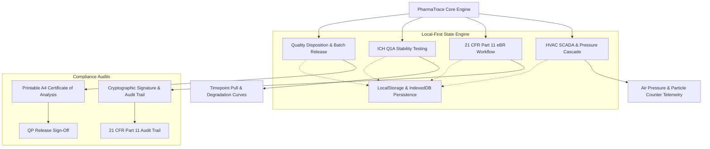

# 💊 PharmaTrace GMP — Pharmaceutical Manufacturing, Cleanroom HVAC & 21 CFR Part 11 eBR OS

<p align="center">
  
  
  
  
  
  
  
  
</p>

> 🚀 **Live Production Application:** [https://olyxmintabansos-byte.github.io/pharmatrace-gmp/](https://olyxmintabansos-byte.github.io/pharmatrace-gmp/)

---

### 🌐 System Overview & Vision

**PharmaTrace GMP (Titan #34)** adalah sistem operasi manufaktur farmasi dan pemantauan fasilitas steril enterprise (*Pharmaceutical Manufacturing Execution System & Cleanroom HVAC SCADA*) yang dirancang sesuai standar kepatuhan regulasi global **US FDA 21 CFR Part 11**, **EU GMP Annex 1**, dan pedoman stabilitas obat **ICH Q1A (R2)**.

Dibangun dengan arsitektur **Client-Side Local-First**, PharmaTrace memproses kaskade tekanan diferensial cleanroom steril secara real-time, pencatatan batch elektronik (*eBR*) dengan tanda tangan kriptografis, pemantauan stabilitas chamber iklim terakselerasi, serta penerbitan sertifikat analisis (*Certificate of Analysis / CoA*) format standar A4 tanpa ketergantungan server runtime atau latensi jaringan.

---

### 🎨 Design System: #9 Material Design Elevation Layers

Antarmuka PharmaTrace mengadopsi bahasa desain **Material Design Elevation Layers**:
- **Tonal Surfaces & Shadows**: Permukaan berlapis dengan elevasi visual yang tegas (`elevation-1` s/d `elevation-4`) menggunakan bayangan multitier lembut untuk membedakan status kaskade udara steril.
- **Clinical Accent Palette**: Palet warna steril berbasis standar farmasi modern (Medical Deep Teal `#00897B`, Sterile Cyan `#00ACC1`, Quarantine Amber `#FFB300`, Alert Excursion `#E53935`, dan Clean Pure White `#FAFAFA`).
- **Tactile Ink Ripples & Card Dividers**: Setiap komponen data batch, kartu instrumen HVAC, dan sampel stabilitas memiliki pemisah visual yang rapi dan terukur.

---

### 🌟 Key Functional Pillars

#### 1. 💨 Cleanroom HVAC Cascade & Environmental SCADA (`/`)
- **Pressure Cascade Multi-Tier**: Pemantauan kaskade tekanan udara diferensial Pascal (Pa) antar zona:
  - **Grade A (Laminar Airflow Workstation)**: Pengisian aseptik steril (0.5µm partikel < 3,520/m³, kaskade +45 Pa).
  - **Grade B (Sterile Core Preparation)**: Ruang persiapan injeksi steril (+30 Pa).
  - **Grade C (Formulation & Compounding)**: Ruang granulasi & pencampuran sediaan (+15 Pa).
  - **Grade D (Personnel & Material Airlocks)**: Ruang ganti dan airlock transfer (+0 Pa).
- **Environmental Telemetry**: Pemantauan suhu (°C), kelembaban relatif (RH%), Air Changes per Hour (ACH), serta status integritas filter HEPA H14 dan DOP leak testing.
- **Real-Time Excursion Alerts**: Peringatan visual instan saat terjadi penurunan tekanan atau lonjakan partikulat di atas ambang batas ISO 14644-1.

#### 2. 📋 21 CFR Part 11 Electronic Batch Record (eBR) (`/batch`)
- **Sequential Manufacturing Stages**: Alur produksi 6 tahap terstandarisasi: *Dispensing -> Granulation -> Drying -> Compression -> Coating -> QC Release*.
- **Cryptographic Electronic Signature**: Penandatanganan digital oleh Apoteker Penanggung Jawab Produksi dengan SHA-256 digital signature hash yang tidak dapat dimanipulasi.
- **In-Process Yield & Deviation Tracker**: Kalkulasi otomatis persentase rendemen hasil (*yield %*), pelacakan nomor lot bahan baku aktif (API), dan pencatatan investigasi deviasi batch.

#### 3. 🌡️ ICH Q1A Stability Chambers & Climatic Testing (`/stability`)
- **Multi-Zone Climatic Chambers**:
  - **Chamber Alpha (Accelerated)**: 40°C ± 2°C / 75% RH ± 5% RH.
  - **Chamber Beta (Intermediate)**: 30°C ± 2°C / 65% RH ± 5% RH.
  - **Chamber Gamma (Long-Term)**: 25°C ± 2°C / 60% RH ± 5% RH.
- **Pull Schedule Matrix**: Manajemen jadwal penarikan sampel pada timepoint 1, 3, 6, 12, dan 24 bulan.
- **Analytical Degradation Trending**: Evaluasi penurunan potensi aktif (*Assay Potency %*), disolusi obat (*Dissolution Rate %*), dan akumulasi total senyawa pengotor (*Total Impurities %*).

#### 4. 📜 Batch Release & Printable Certificate of Analysis (CoA) A4 (`/release`)
- **Quality Assurance Disposition Engine**: Penentuan status akhir batch (*Released for Distribution*, *Quarantine Hold*, atau *Rejected*).
- **Printable A4 Certificate of Analysis (CoA)**: Generator lembar hasil uji mutu resmi format kertas A4 siap print/PDF lengkap dengan kop pabrik, nomor izin edar BPOM/FDA, ringkasan uji fisikokimia & mikrobiologi, serta pengesahan tanda tangan *Qualified Person (QP)* dan *QC Director*.

---

### 🏗️ Architecture & Data Flow



---

### 📁 Directory Layout

```
pharmatrace-gmp/
├── public/
│   └── .nojekyll                 # Jekyll bypass for GitHub Pages
├── src/
│   ├── app/
│   │   ├── batch/page.tsx        # 21 CFR Part 11 electronic Batch Record (eBR)
│   │   ├── release/page.tsx      # Batch disposition & A4 Certificate of Analysis (CoA)
│   │   ├── stability/page.tsx    # ICH Q1A climatic stability chambers & pull schedules
│   │   ├── layout.tsx            # Global layout, cleanroom elevation & navigation
│   │   └── page.tsx              # Executive cleanroom HVAC cascade & environmental SCADA
│   ├── components/
│   │   └── Navbar.tsx            # Material elevation header & cleanroom alert status
│   ├── context/
│   │   └── PharmaContext.tsx     # GMP reactive state machine, batch & HVAC data
│   └── types/
│       └── pharma.ts             # Strict TypeScript models & compliance interfaces
├── next.config.ts                # Static export configuration
└── package.json                  # Dependencies & scripts
```

---

### 🛠️ Technology Stack

| Domain | Technology / Library | Rationale |
|---|---|---|
| **Framework** | Next.js 16.3 (App Router) | Static export optimized for isolated, air-gapped cleanroom environments |
| **Language** | TypeScript (Strict Mode) | Zero build/type errors for critical pharmaceutical data validation |
| **Styling** | Tailwind CSS v4 | CSS-first zero-runtime utility styling with Material Elevation shadows |
| **Icons & UI** | Lucide React | High-clarity medical, laboratory, and industrial vector icons |
| **Visual Effects** | Canvas-Confetti | Regulatory milestone celebration on batch release |
| **Persistence** | Local-First Storage | Offline-first client sovereignty without external database reliance |
| **Deployment** | GitHub Pages (`gh-pages`) | Static hosting with `.nojekyll` bypass |

---

### 🚀 Getting Started & Local Development

Clone repositori dan jalankan pada local development environment:

```bash
# 1. Clone repository
git clone https://github.com/olyxmintabansos-byte/pharmatrace-gmp.git
cd pharmatrace-gmp

# 2. Install dependencies
npm install

# 3. Jalankan development server
npm run dev
```

Buka [http://localhost:3000](http://localhost:3000) pada browser Anda.

#### Build & Static Export

```bash
# Build static export ke direktori out/
npm run build

# Deploy langsung ke GitHub Pages branch gh-pages
npx --yes gh-pages -d out -b gh-pages --dotfiles
```

---

### 📄 License & Attribution

Didistribusikan di bawah lisensi MIT. Silakan gunakan untuk keperluan komersial, audit kepatuhan, maupun edukasi formulasi farmasi.

<p align="center">
  
  
</p>

<p align="center">
  <strong>© 2026 by Olyx (@olyxmintabansos-byte)</strong> • All rights reserved.
</p>
